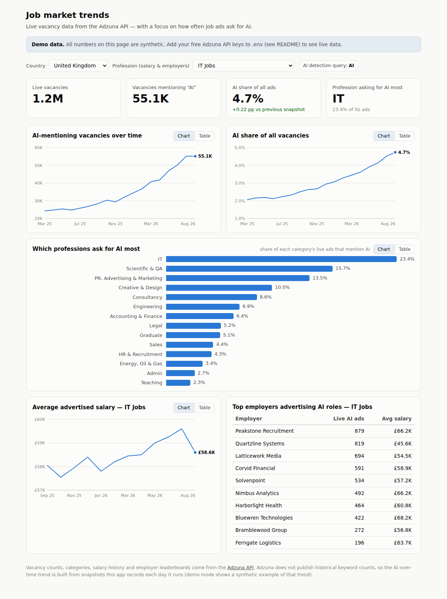

# Adzuna Job Trends Dashboard

A job market trends dashboard built on the [Adzuna API](https://developer.adzuna.com/),
focused on one question: **how much of the job market is asking for AI — and in which
professions?**



## What it shows

- **KPI row** — live vacancies, vacancies mentioning AI, AI share of all ads, and the
  profession with the highest AI share.
- **AI-mentioning vacancies over time** and **AI share of all vacancies** — trend lines.
- **Which professions ask for AI most** — for every Adzuna job category, the share of its
  live ads that mention AI (e.g. IT vs Marketing vs Hospitality).
- **Average advertised salary** for a selected profession, by month (Adzuna's `history`
  endpoint).
- **Top employers advertising AI roles** in the selected profession (Adzuna's
  `top_companies` endpoint).

Filters (country, profession) sit in one row at the top and scope everything below them.
Every chart has a table view, tooltips, and keyboard navigation (focus a line chart and
use ←/→), and the UI follows light/dark mode.

## Quick start

Requires Node 18+. No dependencies, no build step.

```bash
npm start
# open http://localhost:3000
```

Without API keys the app runs in **demo mode** with clearly-labelled synthetic data, so
you can see the full dashboard immediately.

### Going live

1. Register (free) at <https://developer.adzuna.com/> and create an application to get an
   `app_id` and `app_key`.
2. `cp .env.example .env` and fill in `ADZUNA_APP_ID` and `ADZUNA_APP_KEY`.
3. `npm start` again.

On the first live run per country the server scans the market: total + AI counts overall
and for each of Adzuna's ~28 job categories (about 60 API calls). Requests are spaced out
to stay under the free tier's rate limit, so the first scan takes a few minutes — the UI
shows progress — and the result is cached on disk for 24 hours.

## How the AI trend works (and its one limitation)

Adzuna's API is a *live* index plus **salary** history — it does not expose historical
keyword counts. So this app builds the "AI jobs over time" series itself: each day the
server runs, it appends that day's counts to `data/snapshots-<country>.json`. The trend
therefore starts at one point and grows the longer you keep the app running (a daily cron
hit of `http://localhost:3000/api/overview?country=gb` is enough to collect a snapshot).
Demo mode ships an 18-month synthetic series so you can see what the accumulated trend
looks like.

"Mentioning AI" means the ad matches Adzuna's `what=AI` search (configurable via
`ADZUNA_AI_QUERY` in `.env` — e.g. set it to `machine learning` to require both words, or
adjust the code to use Adzuna's `what_phrase`/`what_or` parameters for other definitions).

## Deployment (Railway + Supabase)

The app is deployable anywhere Node runs. The hosted setup uses:

- **Railway** — runs the server continuously. An in-app collector checks hourly and
  records one snapshot per tracked country per day (`SNAPSHOT_COUNTRIES`, default `gb`).
- **Supabase** — durable snapshot storage in Postgres (`adzuna_snapshots` table), so
  history survives redeploys. Reads are public selects; writes go through the
  `record_adzuna_snapshot` security-definer RPC, which validates `SNAPSHOT_SECRET`
  server-side (the anon key alone cannot write).

Environment variables:

| Variable | Purpose |
|---|---|
| `ADZUNA_APP_ID` / `ADZUNA_APP_KEY` | Adzuna credentials — without them the app serves demo data and collects nothing |
| `SUPABASE_URL` / `SUPABASE_ANON_KEY` | Supabase project URL and publishable key |
| `SNAPSHOT_SECRET` | must match the write secret stored in `adzuna_private.config` |
| `SNAPSHOT_COUNTRIES` | comma-separated country codes to snapshot daily (default `gb`) |
| `ADZUNA_AI_QUERY` | keyword(s) defining an "AI" job (default `AI`) |

Without the Supabase variables the app falls back to file storage in `data/`
(fine locally; ephemeral on most hosts).

## Endpoints used

| Adzuna endpoint | Used for |
|---|---|
| `/jobs/{country}/search/1` | vacancy counts (total, AI, per category) |
| `/jobs/{country}/categories` | the profession list |
| `/jobs/{country}/history` | average advertised salary by month |
| `/jobs/{country}/top_companies` | employers advertising the most AI roles |

## Project layout

```
server.js          zero-dependency HTTP server + JSON API + snapshot collector
lib/adzuna.js      Adzuna client (throttling + 24h disk cache)
lib/demo.js        deterministic demo data
public/            dashboard front-end (vanilla JS, hand-rolled SVG charts)
data/              API cache + collected snapshots (gitignored)
```
